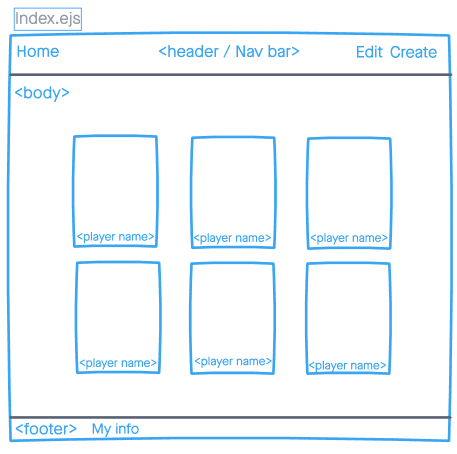

# Soccer Player Stat

## Hello and welcome to my app! 
For this app I am going to create an app that will display you 6 player that influenced me to play the beautiful game along with some key details about the player and their career. I will also give the liberty to users to add their own players that they either follow or would like to be added to the application. Apart from that, if some users don't agree with the stats I've given a player then they will have the liberty to change it to what ever they wish to. 

## Technologies Used: 
The tools I used to build my app: 
- HTML 
- Javascript
- CSS 
- Node Express 
- Node JS 

## Screenshots 

## Screenshot of deployed App

## Get Started!: 

[URL to Heroku deployment](https://soccerplayerstats-project2.herokuapp.com)

## Future Enhancements: 

Will want to add a lot of small details to the app to make it look "professional", fix the little details with styling as well. 